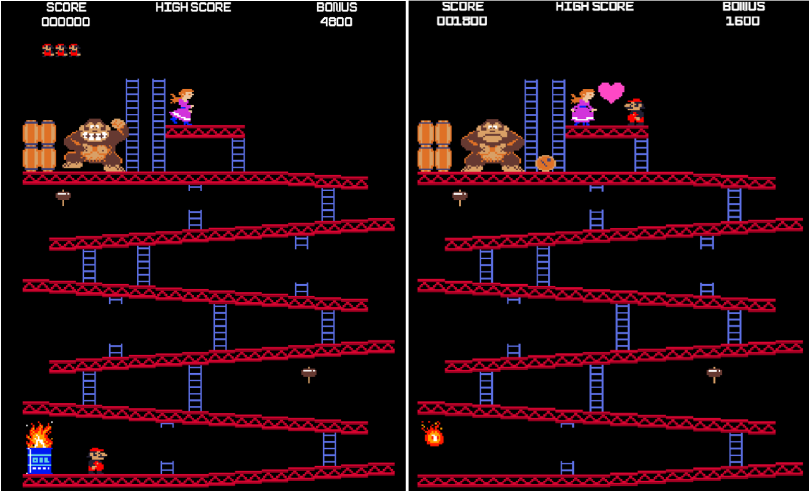

# GodotKong
### A Donkey Kong clone, developed with  Godot.
 

This is a simple rebuild of the classic Donkey Kong arcade game (only the first level) with the Godot Game Engine.

### Toolkit
* Godot Editor & GD-Script for developing the game
* Asesprite for creating graphics